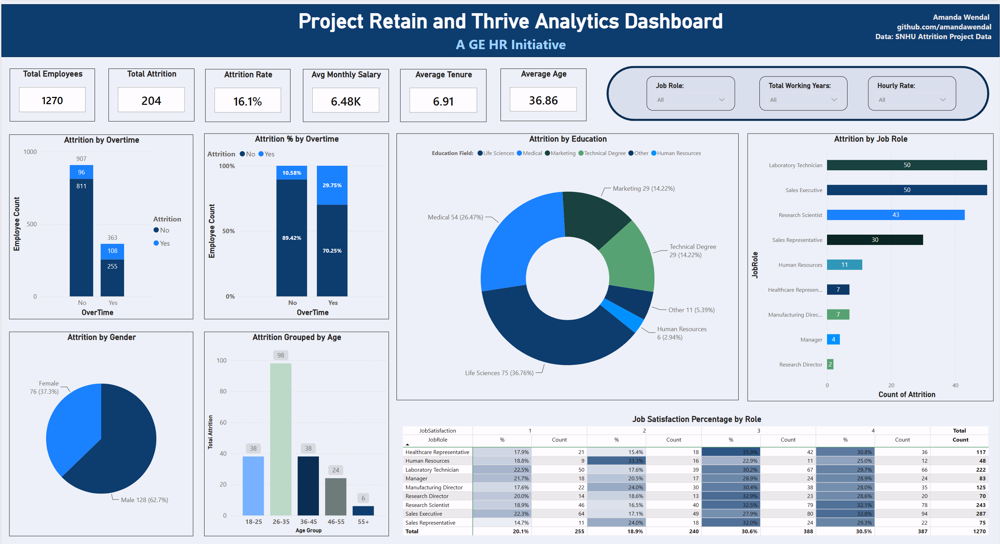

# Project Retain and Thrive: Predicting Employee Attrition

A predictive model in R that identifies employees at risk of leaving, plus a Power BI dashboard that communicates the findings to HR. Built as my MS in Data Analytics capstone using the CRISP-DM framework.

## The question

Can HR data predict which employees are likely to leave, and what factors drive attrition?

## Data

- **Scope:** 1,270 employee records with 35 features, including demographics, job role, compensation, satisfaction scores, and tenure
- **Attrition:** 204 employees left (16.1%), about 1 in 6
- **Source:** Course-provided HR dataset used for an academic case study (a fictional HR initiative framed around GE). This project is not affiliated with GE.

## What I did

**Data preparation**
- Cleaned and recoded variables, removed uninformative fields, and one-hot encoded categorical features
- Split the data 80/20 into training and test sets, stratified to preserve the attrition rate
- Balanced the training set with SMOTE, since only 16% of employees left

**Feature selection**
- Used a Random Forest (500 trees) to rank variable importance across all features
- Checked multicollinearity with Variance Inflation Factor (VIF) analysis
- Refined the Logistic Regression feature set with stepwise AIC selection, down to 13 features

**Modeling and evaluation**
- Built and compared two classification models: Naive Bayes and Logistic Regression
- Tested decision thresholds of 0.5, 0.45, 0.4, and 0.3, choosing 0.4 to catch more at-risk employees while keeping false alarms reasonable
- Validated the final model on a separate verification dataset

## Results

| Metric | Naive Bayes | Logistic Regression (0.4 threshold) |
|---|---|---|
| AUC | 0.748 | **0.809** (0.827 on verification) |
| Sensitivity | 0.650 | **0.800** |
| Specificity | 0.620 | **0.639** |
| Accuracy | 0.625 | **0.664** |

Logistic Regression outperformed Naive Bayes on every metric and was selected as the final model. It correctly identifies **4 out of 5 employees at risk of leaving**.

I prioritized sensitivity over accuracy on purpose: for HR, missing an employee who is about to leave costs more than a false alarm.

## Key findings

- **Overtime is the strongest driver.** Employees who work overtime left at 29.75%, compared with 10.58% for those who don't. They are 29% of the workforce but more than half of all departures.
- **Frequent business travel and being single** were also linked to higher attrition.
- **Satisfaction matters.** Higher job satisfaction, environment satisfaction, and job involvement all lowered the risk of leaving, as did higher income and more years of experience.
- **Younger and entry-level employees leave most.** Employees aged 18–25 left at 36%, and Sales Representatives at 40%.

## Tools

R · RStudio · caret · e1071 · randomForest · pROC · car · Power BI · Power Query · DAX

## About

Capstone project for my MS in Data Analytics at Southern New Hampshire University (DAT-690). The R code and full report are not published here, but I'm happy to walk through them on request.

**Amanda Wendal** · [LinkedIn](https://www.linkedin.com/in/amandawendal/)
